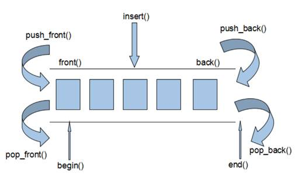

### 3.3 deque容器

#### 3.3.1 deque容器基本概念

**功能：**

* 双端数组，可以对头端进行插入删除操作

**deque与vector区别：**

* vector对于头部的插入删除效率低，数据量越大，效率越低
* deque相对而言，对头部的插入删除速度回比vector快
* vector访问元素时的速度会比deque快,这和两者内部实现有关

deque内部工作原理:

deque内部有个**中控器**，维护每段缓冲区中的内容，缓冲区中存放真实数据

中控器维护的是每个缓冲区的地址，使得使用deque时像一片连续的内存空间

* deque容器的迭代器也是支持随机访问的

#### 3.3.2 deque构造函数

**功能描述：**

* deque容器构造

**函数原型：**

* `deque<T>` deqT;                      //默认构造形式
* `deque(beg, end);`                  //构造函数将[beg, end)区间中的元素拷贝给本身。
* `deque(n, elem);`                    //构造函数将n个elem拷贝给本身。
* `deque(const deque &deq);`   //拷贝构造函数

**总结：**deque容器和vector容器的构造方式几乎一致，灵活使用即可

#### 3.3.3 deque赋值操作

**功能描述：**

* 给deque容器进行赋值

**函数原型：**

* `deque& operator=(const deque &deq); `         //重载等号操作符

* `assign(beg, end);`                                           //将[beg, end)区间中的数据拷贝赋值给本身。
* `assign(n, elem);`                                             //将n个elem拷贝赋值给本身。

总结：deque赋值操作也与vector相同，需熟练掌握

#### 3.3.4 deque大小操作

**功能描述：**

* 对deque容器的大小进行操作

**函数原型：**

* `deque.empty();`                       //判断容器是否为空

* `deque.size();`                         //返回容器中元素的个数

* `deque.resize(num);`                //重新指定容器的长度为num,若容器变长，则以默认值填充新位置。

  ​			                             //如果容器变短，则末尾超出容器长度的元素被删除。

* `deque.resize(num, elem);`     //重新指定容器的长度为num,若容器变长，则以elem值填充新位置。

  ​                                                     //如果容器变短，则末尾超出容器长度的元素被删除。

总结：

* deque没有容量的概念
* 判断是否为空   --- empty
* 返回元素个数   --- size
* 重新指定个数   --- resize

#### 3.3.5 deque 插入和删除

**功能描述：**

* 向deque容器中插入和删除数据

**函数原型：**

两端插入操作：

- `push_back(elem);`          //在容器尾部添加一个数据
- `push_front(elem);`        //在容器头部插入一个数据
- `pop_back();`                   //删除容器最后一个数据
- `pop_front();`                 //删除容器第一个数据

指定位置操作：

* `insert(pos,elem);`         //在pos位置插入一个elem元素的拷贝，返回新数据的位置。
* `insert(pos,n,elem);`     //在pos位置插入n个elem数据，无返回值。
* `insert(pos,beg,end);`    //在pos位置插入[beg,end)区间的数据，无返回值。
* `clear();`                           //清空容器的所有数据
* `erase(beg,end);`             //删除[beg,end)区间的数据，返回下一个数据的位置。
* `erase(pos);`                    //删除pos位置的数据，返回下一个数据的位置。

总结：

* 插入和删除提供的位置是迭代器！
* 尾插   ---  push_back
* 尾删   ---  pop_back
* 头插   ---  push_front
* 头删   ---  pop_front

#### 3.3.6 deque 数据存取

**功能描述：**

* 对deque 中的数据的存取操作

**函数原型：**

- `at(int idx); `     //返回索引idx所指的数据
- `operator[]; `      //返回索引idx所指的数据
- `front(); `            //返回容器中第一个数据元素
- `back();`              //返回容器中最后一个数据元素

总结：

- 除了用迭代器获取deque容器中元素，[ ]和at也可以
- front返回容器第一个元素
- back返回容器最后一个元素

#### 3.3.7  deque 排序

**功能描述：**

* 利用算法实现对deque容器进行排序

**算法：**

* `sort(iterator beg, iterator end)`  //对beg和end区间内元素进行排序

总结：sort算法非常实用，使用时包含头文件 algorithm即可